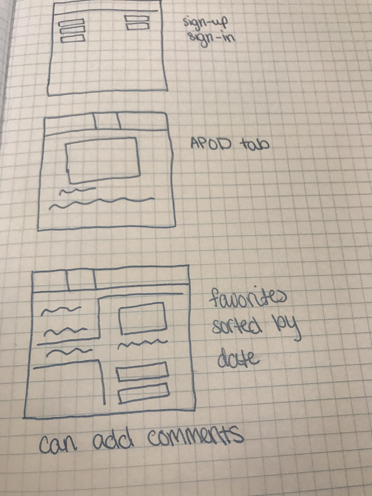
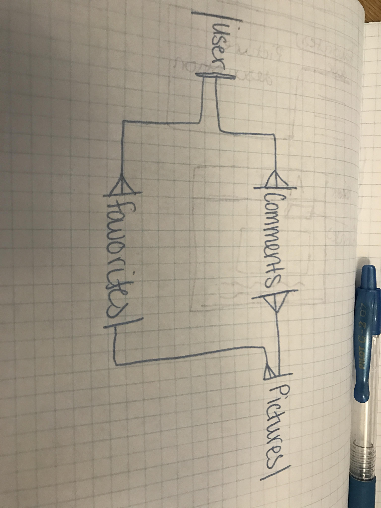

## Links

**Live site:** <https://ggwilliams.github.io/pictures-app-client/>

**Back End Repo:** <https://github.com/ggwilliams/rails-pictures-api>

## Overview
This web application allows users to view APOD and also save their favorite photos and view them later and also comment on them. There are also NEO facts displayed in the search page and users can search through Mars rover photos, NASA patents, and NASA sounds. Users can visit this page if they want to see ore than just APOD. If they want to search Mars rover photos by date they can easily do that. If they want to search through NASA patents, all they need to do is enter a keywork into the search. Or if they want to browse they space sounds, it only takes a click of a button.

## About
To start the front end, I began with testing that the user sign in, sign up, and etc was working properly with the back end. After setting the required files in the appropriate folders, the sign in, sign up and sign out worked properly.

Then I moved on to creating the api calls and the corresponding functions. I started by just indexing the users pictures by clicking a button. Then I needed to create a handlebars file to display the users pictures.

NASA has a lot of APIs that are available to developers. I chose to use, APOD, NEO, Mars Rover, Sounds, and Patents. Each of these takes the same api key but uses different urls.

The NEO function was the shortest one to write,
```
const neoDailyFeed = function () {
  const apiKey = 'T9Rfu2Fl6lIsh6xAlOGq3fKH9q29wtvjvjy1d8la'
  const neoUrl = 'https://api.nasa.gov/neo/rest/v1/feed/today?'
  $.ajax({
    url: `${neoUrl}detailed=true&api_key=${apiKey}`,
    method: 'GET'
  }).then(function (results) {
    $('.neo-results').empty()
    const neoResults = neoTemplate(results)
    $('.neo-results').append(neoResults)
  })
}
```
This function displays the number of near earth objects for the day on the homepage.
I also have another function that shows the total of near earth objects.

I wanted to use more of the NASA apis but some were not relevant to this project.

## Wireframe
Wireframe:


## ERD
1st ERD:


## User Stories
* As a user, I want to view the Astronomy Picture of the Day
* As a user, I want to be able to search through NASA patents
* As a user, I want to be able to search through NASA sounds
* As a user, I want to view my favorites by date and title.
* As a user, I want to search through APOD by date.
* As a user, I want to be able to search through NASA Mars rover photos
* As a user, I want to add a picture to my favorites list
* As a user, I want to view my favorites as a list of the dates the picture was posted
* As a user, I want to delete favorites off of my list
* As a user, I want to comment on my favorite pictures
* As a user, I want to view other users comments on my favorite pictures
* As a user, I want to edit my own comments
* As a user, I want to delete my own comments

## API Functions
I created a different file for all of my api calls so that I could organizae them better. Each function has its own handlebars template to render the results also. Since I want the user to be able to save any APOD photo, I created 2 apod functions. One that only displays the astro picture of the day and one that allows the user to search through the APOD gallery. In order for the user to be able to save these photos, I had to add another function that would save the data from the results to the users favorite list.

This is what the APOD for each day looks like

```
const showApod = function () {
  const apodUrl = 'http://localhost:4741/search/apod/today'
  $.ajax({
    headers: {
      Authorization: `Token token=${store.user.token}`
    },
    url: `${apodUrl}`,
    method: 'POST'
  }).done(function (results) {
    console.log('apod', results)
    $('.apod-results').empty()
    const apodResult = apodTodayTemplate(results)
    $('.apod-results').append(apodResult)
    $('.add-picture').on('submit', function (event) {
      if (event && event.preventDefault) {
        event.preventDefault()
      }
      const data = getFormFields(event.target)
      api.createPictures(data)
          .then(api.addToFavoritesList)
          .then(ui.addPictureToFavorites)
          .fail(ui.addFavoriteFail)
    })
  })
}
```

This is the corresponding handlebars file,
```
<div class="apod-results">
  <h2>Astronomy Picture of the Day</h2>
    <div class="apod-image-and-description">
      <h4>{{title}}</h4>
      <h4>{{date}}</h4>
      {{hdurl}}</img>
      <h5><h4>Copyright:</h4>{{copyright}}</h5>
      <h4 class="apod-description"> <h3>Desription:</h3> {{{explanation}}}</h4>
      <br>
    </div>
    <br>
    <form class="add-picture">
    <fieldset>
      <input type="text" name="picture[title]" value="{{title}}" style="display: none;">
      <input type="text" name="picture[date]" value="{{date}}" style="display: none;">
      <input type="text" name="picture[explanation]" value="{{explanation}}" style="display: none;">
      <input type="text" name="picture[hdurl]" value="{{hdurl}}" style="display: none;">
      <button type="submit" class="btn btn-primary">Save to Favorites</button>
    </fieldset>
  </form>
</div>
```


During testing, I had the url set as a constant in each function. This was easier for me to keep track of my routes and what I wasa doing with each one.
```
const searchApod = function () {
  const apodDate = $('#apod-date').val()
  const data = {
    search: {
      query: apodDate
    }
  }
  const apodUrl = 'http://localhost:4741/search/apod'
  $.ajax({
    headers: {
      Authorization: `Token token=${store.user.token}`
    },
    url: `${apodUrl}`,
    method: 'POST',
    data: data
  }).done(function (results) {
    console.log('apod', results)
    $('.apod-results').empty()
    // for (let i = 0; i < results.photos.length; i++) {
    const apodResult = apodTemplate(results)
    $('.apod-results').append(apodResult)
    $('.add-picture').on('submit', function (event) {
      if (event && event.preventDefault) {
        event.preventDefault()
      }
      const data = getFormFields(event.target)
      console.log('favortie picture data is', data)
      api.createPictures(data)
          .then(api.addToFavoritesList)
          .then(ui.addPictureToFavorites)
          .fail(ui.addFavoriteFail)
    })
  })
}
```
Before deploying, I had to change this so that my config file was used.
```
$.ajax({
  headers: {
    Authorization: `Token token=${store.user.token}`
  },
  url: config.apiOrigin + '/search/apod',
  method: 'POST',
  data: data
}).done(function (results) {
```
Now, the function will call the config file and grab the url from there.
